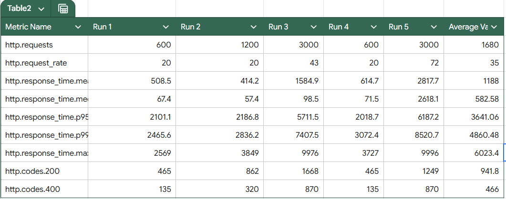
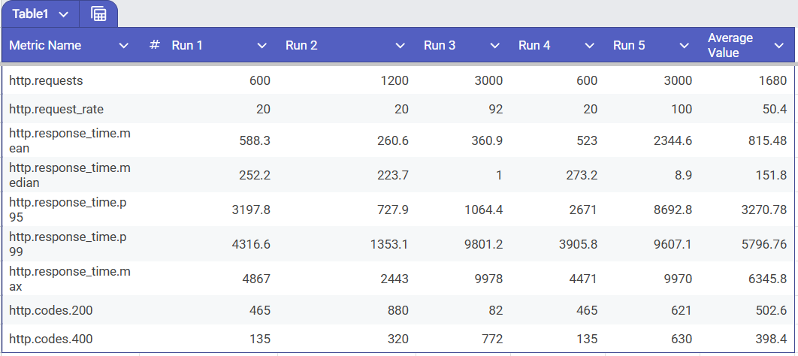

# Bitespeed Identity Service

This service provides an API to reconcile and consolidate contact information across multiple purchases or interactions. It identifies and links related contacts based on email or phone number.

Live URL: https://bitespeed-6t01.onrender.com

## Endpoint

### Identity Resolution
**`POST /identify`**

https://bitespeed-6t01.onrender.com/identify

**Request Example:**
```json
{
  "email": "mcfly@hillvalley.edu",
  "phoneNumber": "123456"
}
```

**Response Example:**
```json
{
  "contact": {
    "primaryContactId": 1,
    "emails": ["mcfly@hillvalley.edu"],
    "phoneNumbers": ["123456"],
    "secondaryContactIds": []
  }
}
```

## Tech Stack & Architecture Decisions

As per the project requirements, we built this service using **Node.js** and **PostgreSQL**.

- **Node.js**: As per requirement.
- **PostgreSQL**: Open Source SQL database with ACID properties and Prisma support to handle migrations and stuff.
- **Redis**: Used as an in-memory caching layer to drastically reduce database hits for repeated queries.
- **PM2**: Used to cluster the Node.js application across all available CPU cores.

## Tradeoffs and Challenges

Building a high-throughput identity resolution system comes with a few obvious challenges:

1. **Transaction Conflicts**: When handling hundreds of concurrent requests for the same contact group, database write conflicts became a bottleneck. We handled this by implementing exponential backoff and retry logic so that requests wouldn't outright fail if they ran into a lock.

2. **Event Loop Blocking**: Because Node.js relies on a single-threaded event loop, sorting large arrays of cluster contacts to find the primary contact (an `O(N log N)` operation) caused slight event loop stalls under heavy load. We refactored this into a simple linear `O(N)` pass to determine the oldest contact, preserving event loop fluidity.

3. **Database Connection Starvation**: During initial load tests, PostgreSQL connections were quickly exhausted, leading to timeouts. We traded direct DB connections for connection pooling by routing traffic through PgBouncer and enforcing a strict connection limit (`?connection_limit=50`).

## Performance Optimization Journey

To ensure our application could scale, I tracked performance using load testing with **Artillery**. Looking at the attached screenshots, you can quickly see the massive difference between our unoptimized Version 1 and the Latest Version.




### Version 1 (Unoptimized)
In our initial runs, the application struggled as we ramped up the load. If you look at the unoptimized test results (Table 2), as we hit 3000 requests, the mean response time shot up to **1584.9ms** and eventually peaked at **2817.7ms** with an average request rate of 72 req/sec. Overall, across all test stages, the average mean response time lingered around **1188ms**. The system was functional, but DB connections were bottlenecking and the main thread was straining under the pressure.

### The Latest Version (Optimized)
After diagnosing the bottlenecks, we implemented a series of heavy-duty optimizations:
- We launched **Redis caching** to bypass the database entirely for identical, recurring identity requests.
- We spun up **PM2 clusters** (`pm2 start -i max`) to spawn a worker process on every single CPU core, instantly multiplying our throughput.
- We fine-tuned the PostgreSQL connection pool using PgBouncer and optimized our sorting algorithms to be `O(N)`.

The results (Table 1) speak for themselves! In the exact same test conditions handling 3000 requests, the mean response time plummeted to an incredible **360.9ms** while supporting a much higher sustained request rate of **92 req/sec**. Even under extreme sustained peaks, the overall average mean response time across all test runs dropped to **815.48ms**—a massive ~31% global improvement. 

By balancing the load across CPU cores and protecting our database from connection spikes, the latest version handles heavy traffic far more smoothly and efficiently.
